# Stars2Cells Parameter Tuning Guide

## Overview
This guide walks through the complete Stars2Cells (S2C) cross-session neuron-matching pipeline, with in-depth parameter explanations and annotated reference plots at every tunable step. S2C borrows an idea from astronomy: the same geometric-hashing trick that astrometry software uses to recognize the same patch of sky from four stars is used here to recognize the same neurons across imaging sessions from four cell bodies — a *quad*. You give it neuron centroids from two or more sessions; it gives you back which neuron is which across all of them.

Every figure below is built from **synthetic, illustrative data** — it shows what each parameter does at its low / good / high extremes, using the same geometry and the same diagnostic views the GUI viewers produce. Regenerate all of them with the companion script:

```bash
python generate_param_plots.py        # writes ./param_plots/*.png
```

---

## Quick Start

1. **Initial Setup**
   - **Windows**: Double-click the **S2C** icon or run `launch_s2c.bat`
   - **Logs**: Every run writes a detailed log. If a step misbehaves, the log records every filename it tried to parse, every quad count, and every threshold it picked — check it first.

2. **Loading Data**
   - **New Analysis**: Start at Step 1: Quad Generation. Point the pipeline at a directory of per-session `.npy` files.
   - **Existing Analysis**: Load a saved parameters file, then run from the step you want to resume at. With `skip_existing = True`, completed sessions/pairs are not reprocessed.

3. **The golden rule**: Bad inputs propagate forward. If Step 3 looks wrong, start debugging at Step 1 — no amount of Step 3 tuning fixes bad quads.

---

## How to Read This Guide

Each tunable step has one or more annotated figures and a **Parameters** block. For steps that are pure validation or hardware configuration, you'll see a short note explaining why there's no deep dive rather than a figure.

Parameters are organized by pipeline step in execution order: **1 → 1.5 → 2 → 2.5 → 3**.

---

## Table of Contents

- [Pipeline Steps](#pipeline-steps)
  - [Step 1: Quad Generation](#step-1-quad-generation)
    - [The Quad Descriptor](#the-quad-descriptor)
    - [knn_k](#knn_k--local-neighborhood-density)
    - [max_triangles_per_diagonal](#max_triangles_per_diagonal--the-k-cap)
    - [quad_keep_fraction](#quad_keep_fraction--global-quality-pruning)
    - [min_pairwise_distance](#min_pairwise_distance--degenerate-quad-filter)
    - [min_coverage_fraction](#min_coverage_fraction--coverage-remediation)
    - [session_filename_regex / diagonal_rng_seed](#session_filename_regex--diagonal_rng_seed)
  - [Step 1.5: Threshold Calibration](#step-15-threshold-calibration)
    - [What "Quality" Actually Means](#what-quality-actually-means)
    - [The Quality Curve and target_quality](#the-quality-curve-and-target_quality)
    - [The √N Scaling Law](#the-n-scaling-law)
    - [Sampling and Sweep Parameters](#sampling-and-sweep-parameters)
  - [Step 2: Quad Matching](#step-2-quad-matching)
    - [distance_metric](#distance_metric)
    - [consistency_threshold](#consistency_threshold--geometric-consistency-filter)
    - [threshold override](#threshold--similarity-threshold-override)
  - [Step 2.5: RANSAC Geometric Filtering](#step-25-ransac-geometric-filtering)
    - [The Residual Histogram](#the-residual-histogram)
    - [ransac_max_residual](#ransac_max_residual--inlier-threshold)
    - [ransac_iterations](#ransac_iterations)
    - [Inlier-Ratio and Transform Constraints](#inlier-ratio-and-transform-constraints)
  - [Step 3: Neuron Matching](#step-3-neuron-matching)
    - [The Cost Matrix and use_quad_voting](#the-cost-matrix-and-use_quad_voting)
    - [dist_cutoff_multiplier](#dist_cutoff_multiplier--distance-cutoff)
    - [Two-Pass Recovery](#two-pass-recovery)
    - [match_confidence](#match_confidence--the-field-to-threshold-on)
    - [Edge-Case Controls](#edge-case-controls)
- [Parameter Tuning Philosophy](#parameter-tuning-philosophy)
- [Tips and Best Practices](#tips-and-best-practices)
- [Common Issues and Solutions](#common-issues-and-solutions)
- [Interpreting Your Results](#interpreting-your-results)
- [A Note on Reproducibility](#a-note-on-reproducibility)

---

## Pipeline Steps

---

### Step 1: Quad Generation

Step 1 builds the descriptors that everything downstream depends on. A **quad** is four neurons. Two of them — the pair that is farthest apart — form the **diagonal**. The other two are the **third-points**. The descriptor encodes where the two third-points sit relative to the diagonal, in a coordinate frame normalized by the diagonal's length. That normalization is the whole point: it makes the descriptor invariant to translation, rotation, and scale, so the same four neurons produce the same descriptor no matter how the field of view has shifted, rotated, or zoomed between sessions.

The diagonal-first pipeline enumerates diagonals directly (local KNN + random long-range), computes perpendicular heights for the other neurons per diagonal, keeps the top-K by height, and pairs those third-points into quads. No triangle enumeration, no `C(N,3)` blow-up. Memory is `O(N·k·K)`.

---

#### The Quad Descriptor

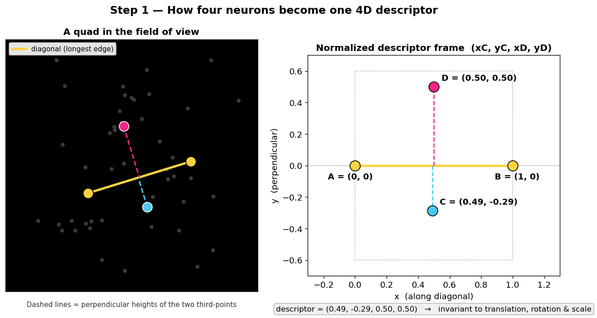

**How to read this figure:** The left panel shows four neurons (highlighted) sitting in a field of view. The two yellow neurons (**A**, **B**) are the diagonal — the longest pairwise edge. The blue and pink neurons (**C**, **D**) are the third-points; the dashed lines are their perpendicular heights off the diagonal line. The right panel shows the same four neurons after normalization: **A** is pinned to `(0, 0)`, **B** to `(1, 0)`, and the descriptor is simply the coordinates of **C** and **D** in that frame — the 4-tuple `(xC, yC, xD, yD)`.

**What to take away:**
- The descriptor is invariant to translation, rotation, and scale by construction. Slide, spin, or zoom the four neurons and the four numbers do not change.
- The pipeline applies a canonical ordering (`xC ≤ xD`) and an axis flip so that mirror-equivalent quads collapse to one descriptor. You don't tune any of this — but it's why two sessions of the *same* neurons land at the *same* point in descriptor space, which is what makes matching possible.
- **Descriptor "quality" = how far the third-points sit from the diagonal line** (`|yC| + |yD|`). A quad whose third-points are nearly *on* the diagonal is "flat" — its descriptor is numerically fragile and barely distinguishable from many others. Tall, well-separated quads are discriminative. This single idea drives three of the parameters below.

---

#### `knn_k` — Local Neighborhood Density

**Default:** `15`  **Range:** `5 – 100`

The number of nearest spatial neighbors used to generate local diagonals per neuron. Long-range diagonals are added automatically at `knn_k // 2`. This is the master dial for how *densely* descriptor space is sampled.

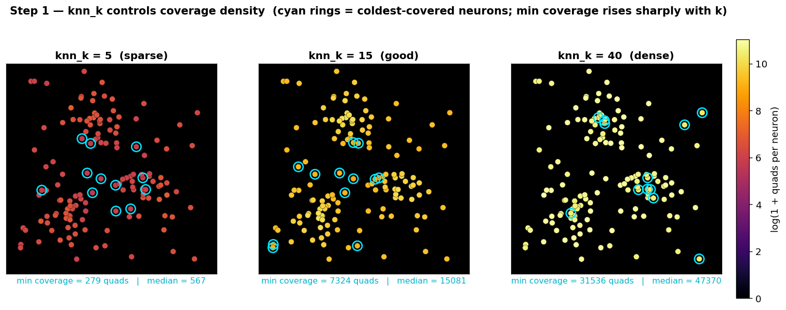

**How to read this figure:** Each panel is the same field of neurons, colored by how many quads each neuron participates in (log scale — the same coloring the Step 1 viewer uses). Cyan rings mark the coldest-covered neurons in each panel. The numbers below each panel are the minimum and median per-neuron quad coverage.

- **`knn_k = 5` (left)** — Sparse. Diagonals are short and local, so neurons in thinly-populated regions barely participate in any quads. Minimum coverage is tiny. Step 2 cannot match a neuron that has no quads, so coverage remediation fires constantly and your match recall suffers in the periphery.
- **`knn_k = 15` (center)** — Good coverage for 100–400 neuron recordings. Most neurons participate in thousands of quads; the cold spots are mild.
- **`knn_k = 40` (right)** — Dense. Every neuron has many overlapping diagonals. Coverage is uniformly high — but quad counts approach the saturation cap, compute scales with `k`, and descriptor space gets crowded enough that *similar-looking* quads start producing false matches.

**The math:** Total unique diagonals ≈ `N × (knn_k + knn_k//2) / 2`. Each diagonal produces up to `C(K, 2)` quads where `K = max_triangles_per_diagonal`. Quad count scales roughly as `N × k × K²`.

**When to increase:** The quad-estimate panel shows neurons with near-zero coverage, or Step 2 match rates are low despite good threshold calibration. Your neurons may be too spread out for `k = 15` to capture enough structure.

**When to decrease:** You're hitting the saturation cap and don't want to touch `quad_keep_fraction`, or your recording has very few neurons (< 50) where `k = 15` already covers the whole field.

---

#### `max_triangles_per_diagonal` — The K-Cap

**Default:** `25`  **Range:** `2 – 500`

For each diagonal, only the top-K third-points — ranked by perpendicular height, i.e. farthest from the diagonal line — are kept. This is applied inline during diagonal construction, not as a post-hoc filter.

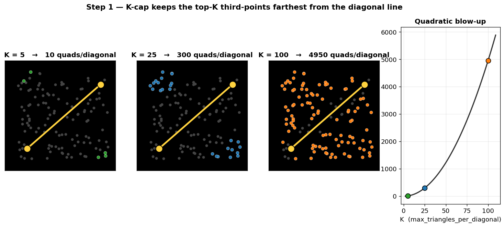

**How to read this figure:** The first three panels show a single diagonal (yellow) and a cloud of candidate third-points. The colored points are the ones kept at `K = 5`, `25`, and `100`. The rightmost panel is the quadratic relationship `quads per diagonal = C(K, 2)`.

- **`K = 5`** — 10 quads per diagonal. Only the tallest, most discriminative third-points survive. Very selective; good for small FOVs with < 80 neurons.
- **`K = 25`** — 300 quads per diagonal. Captures both prominent and moderate geometric features. The right tradeoff for 100–500 neuron recordings.
- **`K = 100`** — 4,950 quads per diagonal. Captures everything, including near-flat quads that hug the diagonal line and add noise without information. Quad counts explode; matching slows to a crawl.

**Interaction with `quad_keep_fraction`:** `K` controls how many quads are *generated* (it prunes at the diagonal level, removing flat third-points). `quad_keep_fraction` controls how many *survive* a final global quality ranking. Both shrink the quad count, but reducing `K` is cheaper (less work generated) while reducing `keep_fraction` is more selective (keeps the best quads from everywhere).

**When to change:** The quad-estimate panel projects your total count. Over the empirical cap (~1.3M quads/session)? Reduce `K`. Well under it with poor match rates? Increasing `K` adds geometric diversity.

---

#### `quad_keep_fraction` — Global Quality Pruning

**Default:** `1.0` (keep all)  **Range:** `0.0 – 1.0`

After all quads are generated, rank them by descriptor quality `|yC| + |yD|` and keep only this fraction.

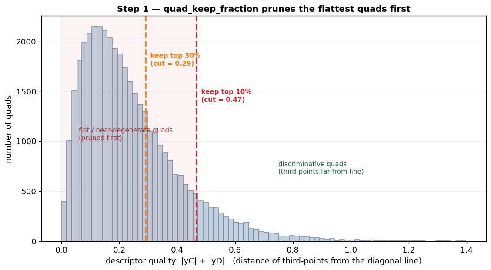

**How to read this figure:** The histogram is the distribution of descriptor quality across all generated quads — right-skewed, because most quads are moderately flat and only a few have third-points far from the diagonal. The dashed lines show where the cut falls for `keep_fraction = 0.3` and `0.1`: everything to the *left* of the line is discarded.

- **`1.0`** — Keep everything. More quads to match against, higher chance of finding valid matches, more noise. Usually fine unless you're over the saturation cap.
- **`0.3`** — Keep the top 30%. A reasonable compromise when you need to cut quad count: removes the flat, near-degenerate quads while preserving geometric diversity.
- **`0.1`** — Keep only the top 10%. Very discriminative descriptors but sparse. Good precision, lower recall — some neuron pairs that should match can't, because their connecting quads were pruned.

**When to touch it:** The quad-estimate panel suggests a value if you're over the cap. Otherwise leave it at `1.0`. If Step 2 match rates are suspiciously high (> 95%), you may have too many similar-looking quads — try `0.5` and see if precision improves.

---

#### `min_pairwise_distance` — Degenerate Quad Filter

**Default:** `0.0` (disabled)  **Range:** `0.0 – 100.0` pixels

Minimum Euclidean distance between any two of the four quad vertices. Quads where any pair of neurons is closer than this are discarded.

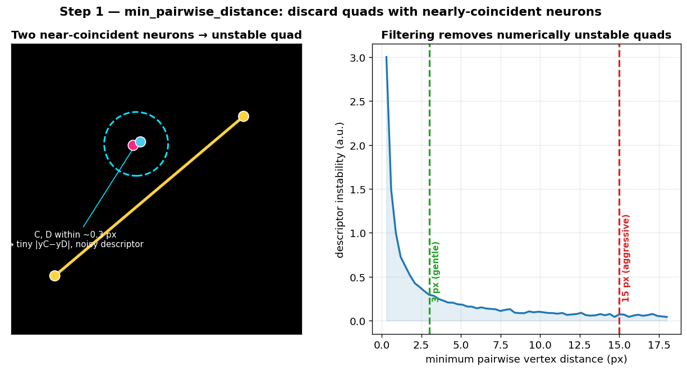

**How to read this figure:** The left panel shows a quad where two vertices are almost on top of each other — the resulting descriptor is numerically unstable (a tiny change in either centroid swings the descriptor wildly). The right panel shows descriptor instability rising sharply as vertex separation shrinks, with the `3 px` (gentle) and `15 px` (aggressive) thresholds marked.

- **`0.0`** — No filtering. Neurons that are nearly coincident can form quads.
- **`3.0`** — Removes quads where two neurons are within 3 px. Eliminates the numerically unstable descriptors without much collateral damage. A good value if your centroid extraction occasionally places two ROI centers 1–2 px apart.
- **`15.0`** — Aggressive — removes many valid quads in dense regions. Only worth it if your centroid extraction has known jitter > 10 px.

**When to use:** If your upstream centroid extraction (CNMF, Suite2p, etc.) sometimes places two ROI centers within a pixel or two. A value of `2.0–5.0` cleans this up. Otherwise leave disabled.

---

#### `min_coverage_fraction` — Coverage Remediation

**Default:** `0.4`  **Range:** `0.0 – 1.0`

To emit each quad exactly once, generation gives ownership of a quad to its longest-edge diagonal. A side effect: some neurons — typically inside dense clusters, where all "their" quads are owned by longer neighboring diagonals — can end up with little or no coverage. Remediation detects these undercovered neurons and re-generates quads for them with the ownership guard relaxed.

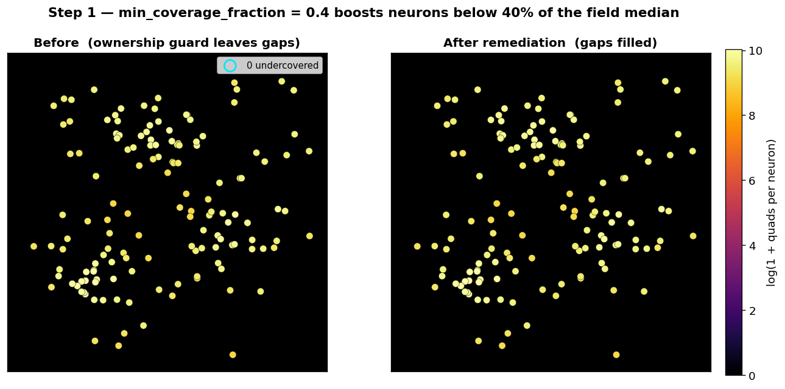

**How to read this figure:** Same coverage heatmap as the `knn_k` figure, before and after remediation. The cyan-ringed neurons on the left fall below the remediation threshold; on the right they've been boosted toward the field median. The threshold is: any neuron with fewer quads than `min_coverage_fraction × median(field coverage)` gets remediated.

- **`0.0`** — Disabled. Neurons that lost coverage to the ownership guard stay cold.
- **`0.4`** — Neurons below 40% of the field median get boosted. Catches the worst gaps without inflating quad counts for neurons that are merely below average.
- **`0.8`** — Very aggressive — anything below 80% of median gets remediated. More uniform coverage, but adds many quads.

**When to touch it:** Open the Step 1 viewer. If you see cold spots on the coverage heatmap (neurons with near-zero coverage), increase this. If remediation is adding thousands of quads and pushing your total past the cap, decrease it.

---

#### `session_filename_regex` / `diagonal_rng_seed`

> **No figure for these — they're plumbing, not geometry.**

**`session_filename_regex`** &nbsp; **Default:** `^([A-Za-z0-9_]+?)_(\d+)__.*\.npy$`

Two capture groups: `(animal_id, session_number)`. This is how the pipeline knows which `.npy` files belong to the same animal and in what order. **If your files aren't being found, this is the first thing to check** — the log records every filename it tries and every one that fails. Common pitfalls: animal IDs containing hyphens when the regex only allows `[A-Za-z0-9_]`; session numbers that aren't purely numeric; or an animal ID ending in digits where the non-greedy `+?` splits at the wrong underscore. For `408021_758519303__day1.npy` the default extracts `animal_id = "408021"`, `session_number = "758519303"`.

**`diagonal_rng_seed`** &nbsp; **Default:** `42`

RNG seed for long-range diagonal sampling (local KNN diagonals are deterministic; the random long-range ones are not). **Change this essentially never.** If changing the seed changes your results meaningfully, that tells you your quad count is too low and you need more coverage — not a different seed.

---

### Step 1.5: Threshold Calibration

Step 1.5 decides *how similar* two quad descriptors must be to count as the same quad. It does this once per animal and bakes the answer into a scaling law.

---

#### What "Quality" Actually Means

> **This is the most commonly misunderstood part of the pipeline.** The "quality" metric in Step 1.5 is **not** a measure of how good your neuron matches are. It measures how cleanly the descriptor-distance threshold separates signal from noise *in descriptor space*.

For recordings with more neurons, descriptor space is more crowded — more quads means more chances for *coincidental* descriptor similarity between unrelated quads. So the threshold needs to be **tighter** (lower) for high-N recordings to maintain the same signal-to-noise ratio. This is why the pipeline fits a `τ = C × √N` scaling law: the optimal threshold scales with the square root of the neuron count, and Step 1.5 calibrates the constant `C`.

---

#### The Quality Curve and `target_quality`

**`target_quality`** &nbsp; **Default:** `0.95`  **Range:** `0.5 – 1.0`

The pipeline sweeps thresholds, computes quality at each, and picks the first threshold where quality reaches `target_quality`.

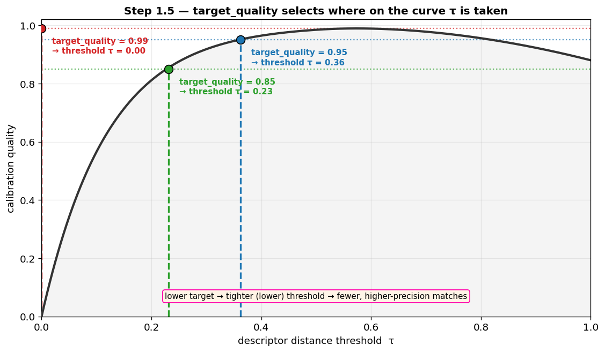

**How to read this figure:** Quality (y-axis) as a function of the descriptor distance threshold (x-axis). The curve rises fast, then plateaus. The three colored markers show where the selected threshold lands for `target_quality = 0.85`, `0.95`, and `0.99`. Note the direction: a **lower** target picks the threshold at an **earlier, tighter** point on the curve.

- **`0.99`** — Very permissive threshold — waits until quality is nearly perfect, which lets in more borderline matches. Higher match counts, more false positives. Works for < 150 neurons.
- **`0.95`** — Moderate. Good default for 150–400 neuron recordings.
- **`0.85`** — Conservative — accepts the threshold early, before quality fully plateaus, giving a tighter threshold. Fewer matches, higher precision. **Use this for > 400 neuron recordings**, where descriptor crowding is a real concern.

> **The common mistake:** Users see "quality = 0.95" and assume they need it *higher* for better results. The opposite is usually true for large-N recordings. Quality measures the *threshold selection point*, not the *match quality*. Pushing `target_quality` up makes the threshold more permissive, which can *decrease* actual match precision.

---

#### The √N Scaling Law

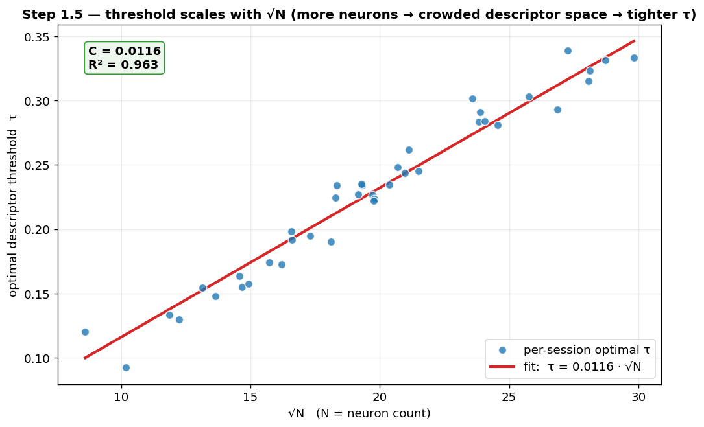

**How to read this figure:** Each blue point is one session pair's empirically optimal threshold `τ`, plotted against `√N`. The red line is the fitted scaling law `τ = C × √N`. The fit quality (`R²`) tells you whether the law holds for your data.

**What to look for:**
- A clean linear fit through the origin with high `R²` (> 0.8) means the scaling law is working — the single constant `C` generalizes across all your sessions.
- A low `R²` means the relationship is noisy. Usual causes: too few session pairs (you need at least 3–4), a sweep range that doesn't cover the true optimum (widen `threshold_min`/`threshold_max`), or sessions grouped together that don't actually share a field of view (fix `session_group_regex`).
- If `C` comes out near zero, your descriptors are pathologically tight or your data has an integrity issue — check the Step 1 quad counts.

---

#### Sampling and Sweep Parameters

> **No figure — these are speed/resolution knobs for the calibration itself.**

- **`sample_size`** (default `10000`) — Quads sampled per session when building calibration pairs. Pure speed/accuracy tradeoff for calibration only; it does not affect actual matching. If your `C` estimate has high standard deviation (`C_std`) relative to `C`, double this and check whether `C_std` drops.
- **`threshold_min` / `threshold_max` / `n_threshold_points`** (defaults `0.0` / `1.0` / `50`) — The sweep range and resolution. If the optimal threshold consistently pins to `threshold_min`, your descriptors are extremely tight (possible data issue). If it pins to `threshold_max`, raise `threshold_max` — the pipeline can't find a good threshold in the current range.
- **`session_group_regex`** (default `__(.+)$`) — Extracts a group key from each session name; sessions in the same group share a field of view and get paired. The default treats everything after `__` as the key. Pairing sessions from *different* FOVs produces meaningless calibration.
- **`session_pair_strategy`** (default `consecutive`) — `consecutive` pairs 1↔2, 2↔3, … (fast, good for longitudinal recordings where adjacent sessions are most similar). `all_vs_all` pairs every combination (more calibration data, but `C(n,2)` pairs — slow, and it multiplies Step 2 compute directly).

---

### Step 2: Quad Matching

Step 2 takes the quad descriptors from Step 1 and the calibrated threshold from Step 1.5, then finds descriptor-similar quad pairs across sessions. This is where FAISS (if available) earns its keep — brute-force descriptor matching at scale.

---

#### `distance_metric`

**Default:** `'cosine'`  **Options:** `'cosine'`, `'euclidean'`

The metric used to compare 4D quad descriptors.

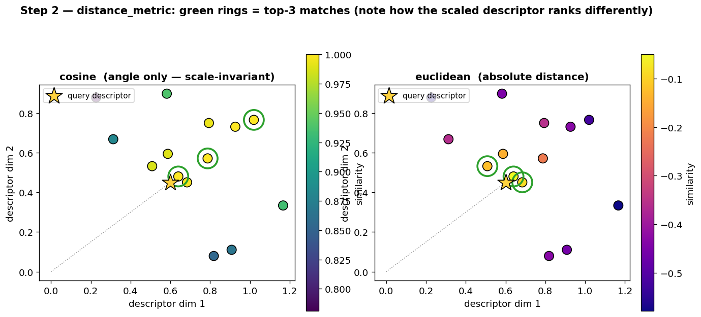

**How to read this figure:** A query descriptor (yellow star) and a cloud of candidates. The left panel ranks candidates by **cosine** similarity (angle only — invariant to descriptor magnitude); the right by **euclidean** distance (absolute position). Green rings mark each metric's top-3 matches. Notice that a descriptor pointing the same direction but with larger magnitude ranks highly under cosine but not euclidean.

- **`cosine`** — Measures the angle between descriptor vectors. Invariant to magnitude, so it's robust to systematic scaling differences (e.g. mixed FOV sizes). The default, and slightly more forgiving of outlier descriptors with unusual norms.
- **`euclidean`** — Measures absolute distance in descriptor space. Fine when your centroids are already normalized to a consistent coordinate frame.

For descriptors whose components are already normalized by diagonal length, the two produce similar rankings. **Most users should leave this at `cosine`.** Switch to `euclidean` only if you've deliberately normalized your coordinate frames and want absolute distances.

---

#### `consistency_threshold` — Geometric Consistency Filter

**Default:** `0.8`  **Range:** `0.0 – 1.0`

After finding descriptor-similar quad pairs, this filter checks whether the geometric transform (rotation, translation, scale) implied by each match agrees with the consensus from the *other* matches in the same session pair. Matches that disagree are discarded.

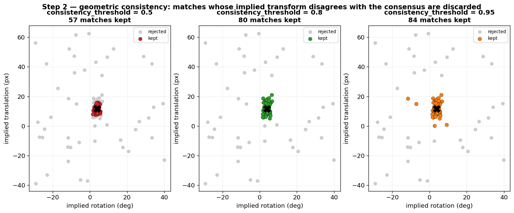

**How to read this figure:** Each point is one quad match, plotted by the rotation and translation its geometry implies. The dense central cluster is the consensus — the true transform between the two sessions. The scattered points are matches implying wildly different transforms (false matches). The three panels show what survives at `consistency_threshold = 0.5`, `0.8`, and `0.95`.

- **`0.5`** — Very permissive. Allows matches with substantial geometric disagreement. More matches survive, more are wrong.
- **`0.8`** — Moderate. Removes the worst outliers while keeping borderline matches.
- **`0.95`** — Strict. Only matches in tight geometric agreement survive. May discard valid matches if there's genuine non-rigid deformation (tissue drift, lens distortion).

**When to decrease:** If your imaging setup has known non-rigid deformation (e.g. a chronic window with tissue growth), the "correct" transform varies across the FOV, and a strict threshold throws out valid matches from the deforming regions.

---

#### `threshold` — Similarity Threshold Override

> **No figure — this is an escape hatch.**

**Default:** `None` (use the calibrated value from Step 1.5)  **Range:** `0.01 – 1.0`

If set, overrides the per-animal calibrated threshold. Useful for debugging or forcing a specific value. But if Step 1.5 produced a threshold you believe is wrong (e.g. `R² < 0.5` in the calibration fit), the better fix is to re-run Step 1.5 with adjusted parameters — a manual override here is a band-aid that hides the underlying calibration problem.

---

### Step 2.5: RANSAC Geometric Filtering

RANSAC estimates the best rigid (or affine) transform between each session pair using the quad matches from Step 2, then classifies each match as an inlier or outlier by how well it fits that transform. This is the step that turns "these quads look similar" into "these neurons are geometrically consistent with a single global alignment."

---

#### The Residual Histogram

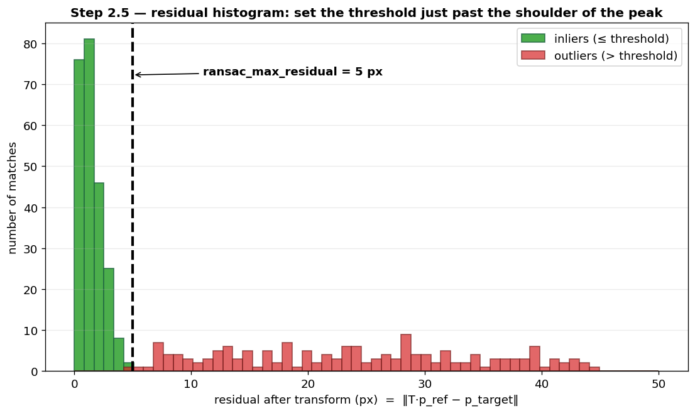

**How to read this figure:** This is what the Step 2.5 viewer shows. The x-axis is each match's residual — the distance, in pixels, between a reference centroid after applying the estimated transform and its matched target centroid. True matches pile up in a tight peak near zero (green); false matches spread across a long flat tail (red). The dashed line is `ransac_max_residual`.

**What to look for:**
- A clear peak near zero with a long tail is the healthy case. Set the threshold just past the shoulder of the peak.
- If the distribution is **bimodal** (two peaks), you likely have a non-rigid deformation — a single rigid transform can't align the whole FOV. Increase the threshold or reconsider the experimental setup.
- If there's no peak at all, Step 2 produced mostly false matches — go back and tighten the Step 2 threshold rather than fighting it here.

---

#### `ransac_max_residual` — Inlier Threshold

**Default:** `5.0` pixels  **Range:** `0.1 – 100.0`

The maximum post-transform distance for a match to count as an inlier. **This is the single most important parameter in Step 2.5**, and it propagates into Step 3 as the basis for several distance cutoffs.

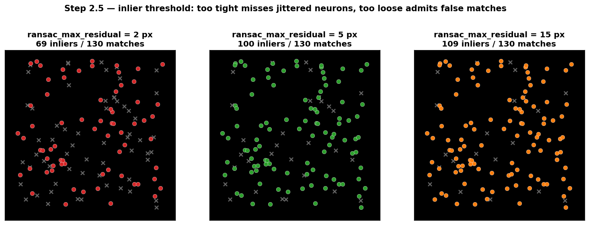

**How to read this figure:** The same set of matched neurons classified at three thresholds. Colored points are inliers (matches within the residual); gray ×'s are rejected. The inlier count is printed above each panel.

- **`2.0`** — Very tight. Only matches landing within 2 px survive. High precision, but misses neurons with moderate centroid jitter or slight non-rigid deformation. Good for stable, head-fixed FOVs.
- **`5.0`** — Standard. Accommodates typical centroid uncertainty (2–3 px) plus minor session-to-session drift. The right balance for most datasets.
- **`15.0`** — Permissive. Matches survive with up to 15 px of residual. Many false inliers, and — worse — the contamination corrupts the transform estimate itself. Only for sessions with large non-rigid deformation.

**The math:** RANSAC samples minimal subsets (3 point-pairs for affine), fits a transform, counts inliers within `ransac_max_residual`, and keeps the transform with the most inliers. If the true residual spread is `σ ≈ 2 px`, setting the threshold to `3σ ≈ 6 px` captures ~99.7% of true inliers.

**When to adjust:** Read it off the residual histogram above. Set it just past the peak's shoulder.

---

#### `ransac_iterations`

**Default:** `1000`  **Range:** `100 – 10,000`

How many random subsets to try. More iterations → higher probability of finding the globally optimal transform.

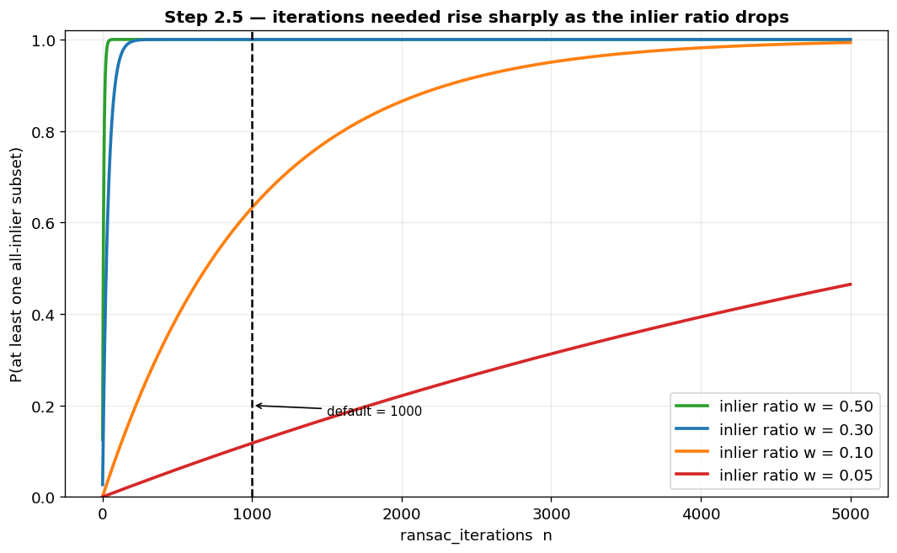

**How to read this figure:** The probability of sampling at least one all-inlier minimal subset, as a function of iteration count, for several inlier ratios `w`. The default of 1000 iterations is marked.

`P = 1 − (1 − wˢ)ⁿ`, with subset size `s = 3`. For a healthy 30% inlier ratio, 1000 iterations gives `P ≈ 1.0`. But at a 10% inlier ratio, `P ≈ 0.63` — you're rolling the dice. Below ~5% inliers, push iterations to 5000+.

**When to increase:** When `ransac_min_inlier_ratio` is very low (< 0.05), or your Step 2 match count is huge (> 100k) and the true inlier fraction is small. The curve above tells you how many iterations you need to be safe.

---

#### Inlier-Ratio and Transform Constraints

> **No figure — these are guard rails, set them from what you know about your prep.**

- **`ransac_min_inlier_ratio`** (default `0.05`) — The minimum fraction of matches that must be inliers for the transform to be accepted; otherwise the session pair is flagged as having no valid geometric relationship. `0.05` suits typical match sets (true inlier ratio 10–50%). If Step 2.5 rejects pairs you know should match — because loose Step 2 thresholds produced many false descriptor matches — drop this to `0.02` or `0.01` to let RANSAC find the signal in the noise.
- **`ransac_max_rotation_deg`** (default `None`) — Reject any transform implying rotation beyond this angle. `None` = no limit (use for freely-moving animals or scope repositioning). Set `5°` for chronic-window or head-fixed recordings where orientation shouldn't drift, or `30°` to allow some repositioning while rejecting clearly spurious large rotations.
- **`ransac_max_translation_px`** (default `None`) — Reject transforms implying translation beyond this. Same logic: for a 512×512 chronic-window FOV, translations > 100 px between sessions are unusual and likely spurious.

---

### Step 3: Neuron Matching

Step 3 takes the RANSAC-filtered matches and transform from Step 2.5 and produces the final neuron-to-neuron assignments. It uses a padded Hungarian algorithm followed by automatic second-pass recovery on any leftover unmatched neurons. Each surviving match gets a confidence score in `[0, 1]`.

---

#### The Cost Matrix and `use_quad_voting`

**`use_quad_voting`** &nbsp; **Default:** `True`

Controls how the neuron-to-neuron cost matrix is built before the Hungarian assignment runs.

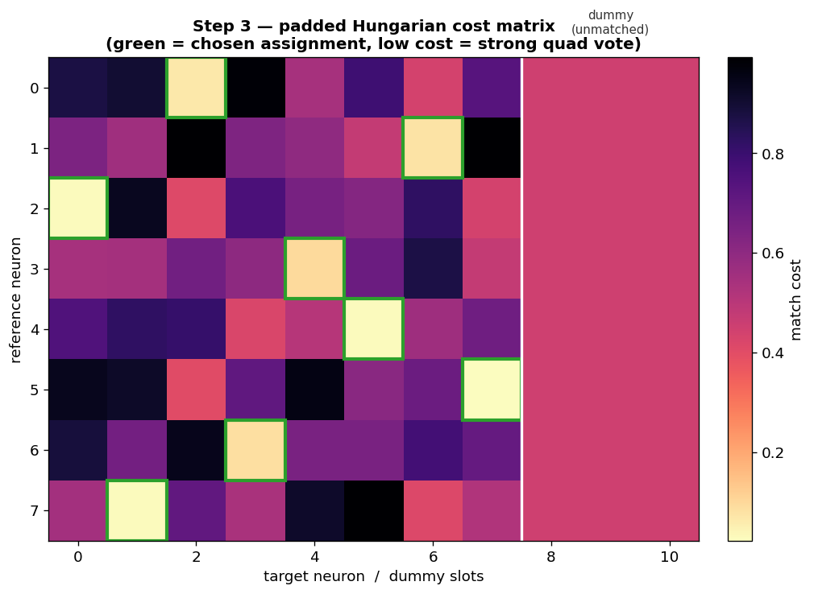

**How to read this figure:** Rows are reference neurons, columns are target neurons (plus a block of "dummy" columns at the right, separated by the white line). Each cell is the cost of matching that pair — darker is more expensive. The green outlines are the assignment the Hungarian algorithm chose: one low-cost cell per row. The dummy columns give every neuron the option to stay *unmatched* at a fixed cost, rather than being forced into a bad pairing.

- **`True` (recommended)** — Degree-normalized quad voting. If reference neuron `i` and target neuron `j` co-appear in many inlier quads, their cost is low. Normalizing by `√(degree_i × degree_j)` stops high-degree hub neurons from dominating. Quad voting provides strictly more information than distance alone.
- **`False`** — Pure spatial distance fallback: cost = Euclidean distance after the RANSAC transform, ignoring quad evidence. Only for debugging, or when you suspect the quad-voting signal is unreliable (very few inlier quads per pair).

---

#### `dist_cutoff_multiplier` — Distance Cutoff

**Default:** `3.0`  **Range:** `1.0 – 20.0`

Neuron pairs farther apart than `dist_cutoff_multiplier × ransac_max_residual` (after transform) are assigned infinite cost — they can't be matched.

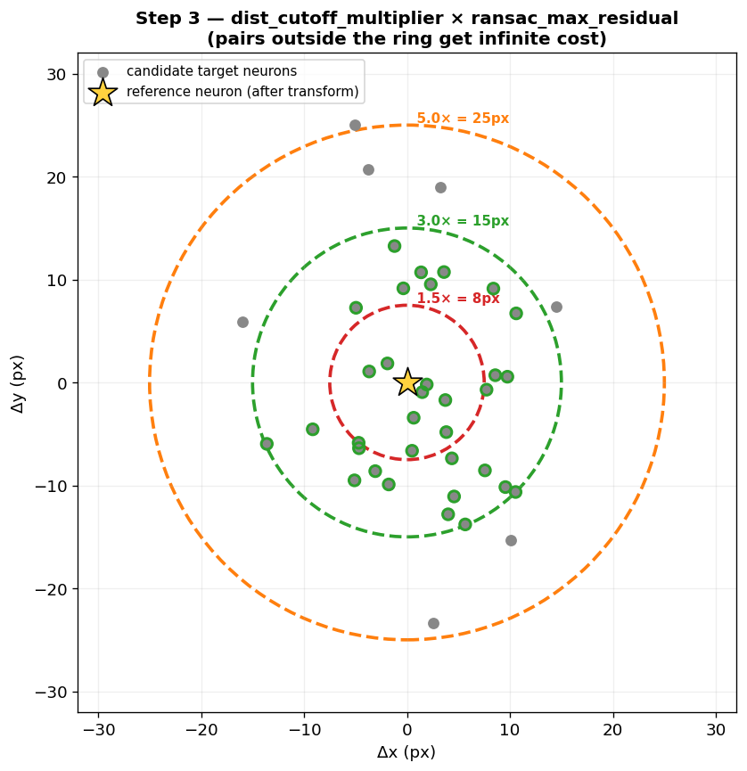

**How to read this figure:** A reference neuron (yellow star, after transform) surrounded by candidate target neurons. The dashed rings are the cutoff radius at `1.5×`, `3×`, and `5×` the RANSAC residual. Candidates inside the chosen ring (green) are matchable; everything outside is blocked.

- **`1.5`** (7.5 px at default residual) — Very tight. Only very close pairs match. Misses neurons with moderate centroid uncertainty.
- **`3.0`** (15 px) — Standard. Covers 3× the RANSAC residual — captures virtually all true matches while excluding distant neurons.
- **`5.0`** (25 px) — Permissive. Allows matches between moderately far neurons. Risk of false matches in dense regions.

**When to increase:** If you can see (from overlaid centroids) that two neurons are clearly the same cell but aren't matching because they're just outside the cutoff — common with slight non-rigid deformation the rigid transform doesn't capture.

---

#### Two-Pass Recovery

S2C runs the Hungarian assignment, removes any pass-1 matches that exceed a post-filter cutoff, then gives the leftover unmatched neurons a second, more relaxed chance.

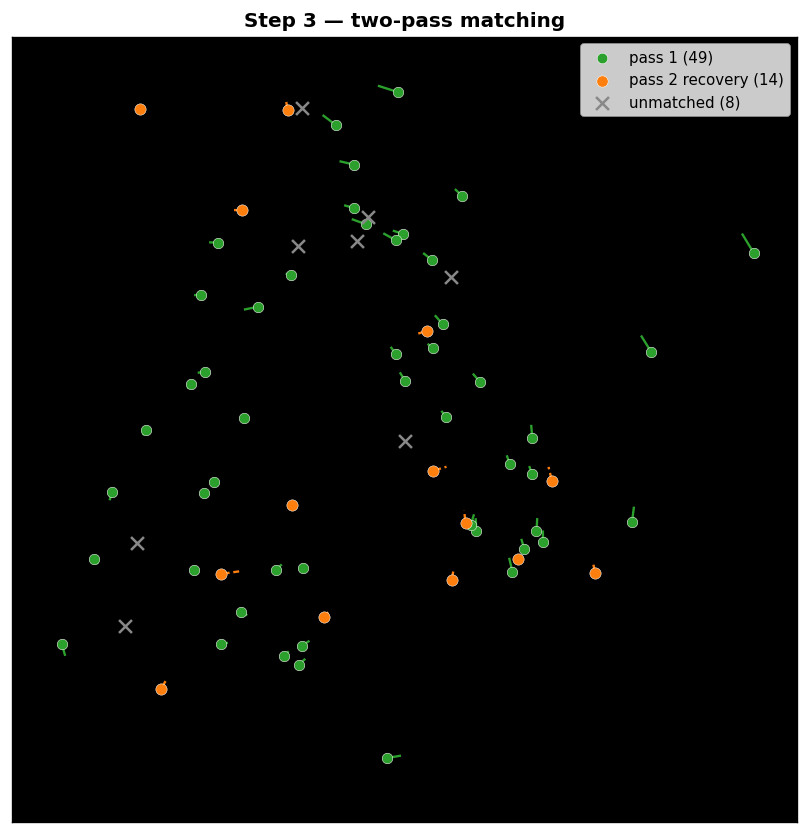

**How to read this figure:** Reference neurons colored by how they were matched. Green = matched cleanly in pass 1. Orange = recovered in the more relaxed pass 2 (note the longer displacement lines — these neurons drifted further). Gray × = genuinely unmatched. The short lines connect each reference neuron to its target.

**The relevant parameters:**
- **`postfilter_residual_multiplier`** (default `1.0`, range `0.5–10.0`) — After pass 1, matches whose transformed distance exceeds `postfilter_residual_multiplier × ransac_max_residual` are removed. `0.5` (2.5 px) is a very tight post-filter that dumps a lot of work onto pass 2; `2.0` (10 px) is permissive and lets more pass-1 matches stand.
- **`pass2_cutoff_multiplier`** (default `2.0`, range `1.0–10.0`) — The recovery distance cutoff, `pass2_cutoff_multiplier × ransac_max_residual`. Intentionally looser than pass 1. `4.0` recovers neurons up to 20 px away (at 5 px residual) — appropriate for non-rigid deformation, risky otherwise.
- **`pass2_dummy_percentile`** (default `75.0`, range `10–99`) — The dummy cost in the second pass, set to this percentile of finite costs. Higher → harder to leave neurons unmatched → more matches recovered. `50` is conservative; `95` forces matches on almost everything (and will invent matches for neurons that genuinely have no partner).

**When to adjust:** If tracking shows neurons "appearing" in a later session that were clearly present earlier but went unmatched in the transition, increase `pass2_cutoff_multiplier` or `pass2_dummy_percentile`. If the recovery set (pass = 2) contains obvious false matches, decrease them.

---

#### `match_confidence` — The Field to Threshold On

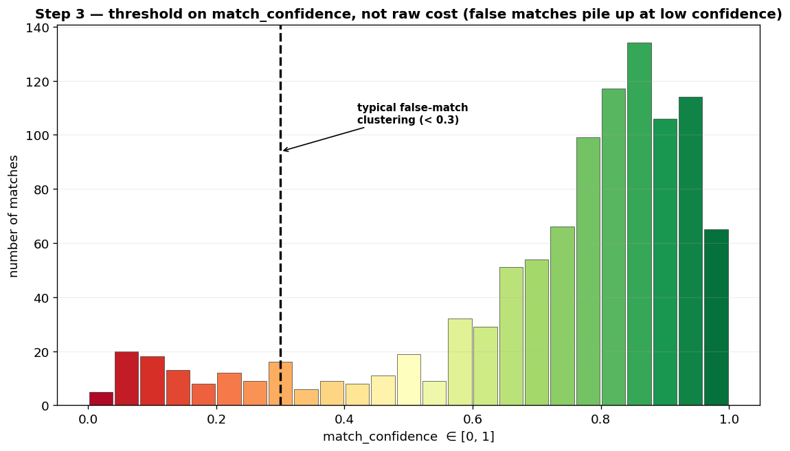

**How to read this figure:** A histogram of per-match confidence, colored red→green by confidence (the same RdYlGn coloring the Step 3 viewer uses). Real matches pile up at high confidence; false matches cluster at the low end (typically below 0.3).

> **Use the confidence outputs, not the raw cost.** The `matched_costs` field depends on whether you enabled quad voting and which dummy-cost regime you used, so cost thresholds aren't comparable across runs. `match_confidence` is normalized to `[0, 1]` and combines four signals — degree-normalized votes, spatial proximity, assignment margin, and pass-1 vs pass-2 origin — making it the right field to threshold on for downstream analyses. Consolidated tracks inherit a `track_confidence` equal to the weakest link in their chain.

**How to use it:** Before hunting for individual bad matches by eye, look at the confidence histogram. False matches show up as a low-confidence tail. A clean recording has a tight high-confidence cluster and a sparse low tail; a problematic one has a fat low-confidence shoulder. Threshold at ~0.3 for a conservative match set, lower if you need recall.

---

#### Edge-Case Controls

> **No figure — enable these only to fix a specific, observed symptom.**

- **`use_asymmetric_dummy_costs`** (default `False`) — Scale each neuron's dummy (unmatched) cost by how close its best potential partner is. Isolated neurons become easy to leave unmatched; neurons with a close partner become hard to. **Enable this if you see obviously wrong matches at the FOV boundary** — peripheral neurons forced into distant pairings because the uniform dummy cost was too high.
- **`block_zero_vote_pairs`** (default `False`) — Hard-block any neuron pair with zero quad votes, regardless of distance. `False` lets spatially-close zero-vote pairs match via a distance fallback (safer for most data — the second pass catches what voting missed). `True` demands quad evidence for every match: higher precision, but misses neurons with poor quad coverage. Only enable it when you're confident in your coverage (high `knn_k`, no cold spots).

---

## Parameter Tuning Philosophy

**Steps 1 and 1.5 are foundation.** They build the descriptors and calibrate the one threshold everything keys off. Over-tuning here is rarely the best use of time — but *under*-covering in Step 1 (too small `knn_k`, too small `K`) starves every step downstream, and a bad √N fit in Step 1.5 quietly poisons matching for the whole animal. Get coverage and calibration into a sane regime, then move on.

**Step 2.5 is the geometric backbone.** `ransac_max_residual` is the most consequential single number in the pipeline — it sets the inlier criterion here *and* the basis for Step 3's distance cutoffs. Tune it from the residual histogram, not by guessing.

**Step 3 is where the final assignments live, and where the edge-case knobs matter.** Most of its parameters are derived from `ransac_max_residual` via multipliers, so they move together. Reach for the boolean flags (`use_asymmetric_dummy_costs`, `block_zero_vote_pairs`) only to fix a specific symptom you can see.

**On match rates and what's real:** A low match rate is not automatically a failure. Neurons genuinely appear and disappear across sessions (GCaMP expression changes, focal-plane drift, cells moving out of frame). Forcing a high match rate by cranking `pass2_dummy_percentile` to 95 doesn't recover real neurons — it invents matches. High-confidence matches for the neurons that are truly trackable are worth more than a inflated match count padded with low-confidence guesses.

**On generalizability:** Defaults are starting points developed with specific data in mind. Your optimal parameters depend on neuron density, FOV size, centroid-extraction quality, session-to-session stability, and whether your prep deforms. Treat every suggested value as an informed first guess and read the diagnostic plots at each stage as your evidence for whether to adjust.

---

## Tips and Best Practices

1. **Debug from the front.** Step 3 looks wrong? Start at Step 1. Bad quads can't be fixed downstream.
2. **Watch the quad-estimate panel.** It projects your total quad count before generation. Staying under the saturation cap (~1.3M quads/session) is a tuning task — adjust `K`, `knn_k`, or `quad_keep_fraction`.
3. **Calibrate, don't override.** A manual Step 2 `threshold` hides calibration problems. Fix Step 1.5 instead.
4. **Set `ransac_max_residual` from the histogram.** It's the most important number in the pipeline and it propagates into Step 3 — don't guess it.
5. **Threshold on `match_confidence`, never raw cost.** Cost isn't comparable across runs; confidence is normalized to `[0, 1]`.
6. **Lower `target_quality` for high-N recordings.** Counter-intuitive but correct: a lower target produces a *tighter* threshold, which is what crowded descriptor spaces need.
7. **Check your session grouping.** `session_group_regex` must group sessions that share a field of view. Pairing different FOVs produces garbage calibration and matching.
8. **Use `skip_existing` to resume — but delete outputs after changing parameters.** The pipeline checks for file existence, not parameter changes; stale outputs will be silently reused.
9. **Read the logs.** Every parsed filename, quad count, and chosen threshold is logged. Most "nothing matched" problems are a regex mismatch the log already caught.
10. **Inspect confidence distributions, not individual matches.** Bad matches reveal themselves as a low-confidence tail far faster than spotting them one by one.

---

## Common Issues and Solutions

**No sessions found in Step 1**
- `session_filename_regex` doesn't match your filenames. Check the log — every failed match is recorded.

**Quad counts are zero or very low**
- Your `.npy` files aren't in the expected format (dict with `centroids_x`/`centroids_y`, or a 3D spatial-footprint array). Check the log for "Unrecognised file format."
- `knn_k` is too small for a spread-out field — neurons in sparse regions have no quads. Increase it.

**Quad counts exceed the saturation cap**
- Reduce `max_triangles_per_diagonal` or `quad_keep_fraction`. The estimate panel suggests specific values. This is a tuning issue, not a data issue.

**Step 1.5 `C` is near zero or `R²` is very low**
- Too few session pairs (you need 3–4+), or the sweep range doesn't cover the optimum (widen `threshold_min`/`threshold_max`).
- `session_group_regex` may be grouping sessions that don't share a FOV.

**Step 2 match rates are > 95%**
- Threshold too loose. *Lower* `target_quality` in Step 1.5 to tighten it. The most common calibration error for high-N recordings — coincidental descriptor similarity inflates the count.

**Step 2 match rates are near zero**
- Threshold too tight, or sessions genuinely don't share neurons (different FOVs or animals grouped together). Verify your grouping.

**Step 2.5 RANSAC inlier ratio is very low (< 5%)**
- Most quad matches are false — a Step 2 threshold problem. Tighten it. Or, if you believe the signal is there, increase `ransac_iterations` so RANSAC can find the rare good subset.

**Step 2.5 residual histogram is bimodal**
- Non-rigid deformation: one rigid transform can't align the whole FOV. Increase `ransac_max_residual`, or reconsider the experimental setup.

**Step 3 match rates are low despite a good RANSAC inlier ratio**
- The cost matrix is too restrictive. Increase `dist_cutoff_multiplier`, or enable `use_asymmetric_dummy_costs`. Check the Step 3 viewer — if most costs are infinite, the cutoff is too tight.

**Step 3 produces obvious false matches**
- Look at the `match_confidence` distribution first — false matches cluster below ~0.3. Then: enable `block_zero_vote_pairs`, lower `pass2_dummy_percentile`, or tighten `postfilter_residual_multiplier`. Boundary false matches → enable `use_asymmetric_dummy_costs`. False matches that are mostly `match_pass == 2` → lower `pass2_cutoff_multiplier`.

**Tracking shows neurons "appearing" that should have been tracked**
- Pass-2 recovery isn't reaching far enough. Increase `pass2_cutoff_multiplier` or `pass2_dummy_percentile`.

---

## Interpreting Your Results

After a full run you have, per animal, a set of cross-session neuron assignments and consolidated tracks.

### Neuron Matches
- **What they show**: Which neuron in each session corresponds to which neuron in the others.
- **What to look for**: A tight high-confidence cluster in the `match_confidence` histogram and a sparse low tail. Match rates that are plausible for your prep's known turnover.
- **Red flags**: A fat low-confidence shoulder (false matches); match rates near 100% on a high-N recording (threshold too loose); near-zero match rates (threshold too tight or wrong grouping).

### Consolidated Tracks
- **What they show**: Neurons followed across the whole session sequence, each with a `track_confidence` equal to its weakest link.
- **What to look for**: Track lengths consistent with how many sessions a neuron should plausibly persist across.
- **Red flags**: Many short tracks that fragment at a particular transition (usually a Step 2.5/3 cutoff that's too tight for that pair); a neuron "disappearing" and a near-duplicate "appearing" in the same session (a missed match, not a real event).

### The Transforms
- Every session pair has an estimated rotation, translation, and scale. These should be small and consistent for a stable prep. Large or wildly varying transforms point to scope repositioning, non-rigid deformation, or — if implausible — spurious RANSAC fits worth investigating.

Remember: the pipeline tells you which centroids correspond, but biological interpretation is yours. When a match looks surprising, overlay the two sessions' centroids and look.

---

## A Note on Reproducibility

Every parameter is saved in the output files. Step 1 records `generation_method: "diagonal_first"`; Step 1.5 saves the full threshold sweep and the fitted `C`; Step 3 saves its parameters plus per-match diagnostics (`match_confidence`, `match_pass`, `matched_costs`) in each `*_sweep.npz`, and per-track confidence (`track_confidence`, `track_mean_confidence`) in the consolidated tracking file. Even if you forget which run produced which file, you can compare both the inputs (parameters) and the outputs (confidence distributions) directly.

The pipeline is deterministic given identical inputs and parameters, with one exception: `diagonal_rng_seed` controls the random long-range diagonals in Step 1. If you can't reproduce a result, compare the saved parameters between runs first, then the confidence histograms.

---

*Figures in this guide are generated by `generate_param_plots.py` from synthetic illustrative data. Run it to (re)create the `param_plots/` directory referenced throughout.*
